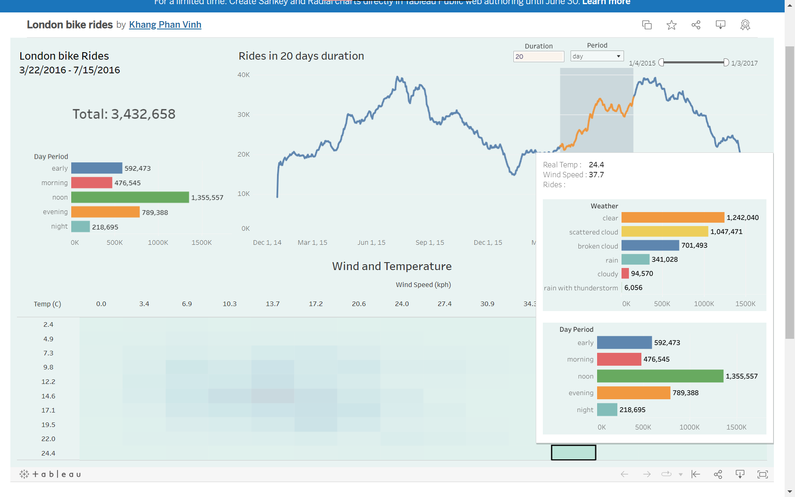

<h1 align="center">
    LONDON BIKE SHARE ANALYTICS: Exploring Bike Riding Patterns in Different Intervals
</h1>

This project focuses on analyzing London bike shares data by performing data preprocessing and visualization using Tableau. The goal is to gain insights into bike riding patterns and intervals to better understand the usage of bike shares in London.

## Data Preprocessing
The data preprocessing stage involves several steps to prepare the data for analysis:

- **Splitting Time Intervals**: The time intervals in the dataset are split from hourly intervals to day periods (e.g., morning, afternoon, evening) and day of the week (e.g., Monday, Tuesday, etc.). This allows for a more granular analysis of bike rides based on different timeframes.
  
- **Renaming Qualitative Variables**: Qualitative variables in the dataset are renamed to string values corresponding to their meanings. This enhances the interpretability of the data and makes it easier to understand the variables during analysis.
  
- **Renaming Columns**: Column names in the dataset are renamed to ensure clarity and consistency throughout the analysis process. The new column names reflect the information they represent, making it easier to identify and work with specific variables.

## Tableau Visualization
The data analysis is performed using Tableau. 

 </img>

For interaction, visit this [Tableau Public link](https://public.tableau.com/app/profile/khang.phan.vinh/viz/LondonbikeridesbyKhang/Dashboard).

The project includes a dashboard consisting of the following views:

- **Heatmap - Wind Speed vs. Temperature**: This visualization showcases the relationship between wind speed and temperature using a heatmap. Additionally, it provides insightful information through bar charts that display the ride counts for different day periods and days of the week. This allows for an exploration of how weather conditions may influence bike rides during specific timeframes.

- **Line Chart - Total Ride and Peak Rides**: The line chart represents the total ride count over time. It provides an overview of the overall trend in bike rides. Additionally, it highlights peak ride counts during adjustable time intervals, allowing for the identification of periods with higher demand and potential factors contributing to those peaks.

- **Total Bikes View**: This view provides an overview of the total number of bikes available for sharing. It helps understand the availability of bikes at different times, which can be valuable for resource management and optimization.

## Conclusion
This project aims to provide a comprehensive analysis of London bike shares data by leveraging data preprocessing techniques and Tableau visualizations. By examining bike riding patterns, relationships with weather conditions, and peak ride counts, the project offers valuable insights for understanding bike share usage in London.

